The data about hospitalizations with COVID-19 in Moscow are hard to find in public datasets. However these data are daily published in the specialized Telegram channel, so they can be parsed from there to be used in data analysis.

The first step is to download Telegram chat stream. That can be easily done with the desktop [Telegram client](https://winaero.com/export-chat-history-file-telegram-desktop/) so I will skip this step and assume that the necessary data, i.e. a set of files "messages.html" is ready ([here is the copy](https://drive.google.com/drive/folders/1RxlKL6kQ1FtsFyg9v-AutkkwGJbdNnja?usp=sharing)). Below I will explain how to convert them into a dataset.


```r
#Usual libraries
library(purrr)
```

```
## Warning: package 'purrr' was built under R version 3.6.3
```

```r
library(stringi)
```

```
## Warning: package 'stringi' was built under R version 3.6.2
```

```r
library(stringr)
library(data.table)
```

```
## Warning: package 'data.table' was built under R version 3.6.3
```

```
## 
## Attaching package: 'data.table'
```

```
## The following object is masked from 'package:purrr':
## 
##     transpose
```

```r
library(ggplot2)
```

```
## Warning: package 'ggplot2' was built under R version 3.6.3
```

```r
library(lubridate)
```

```
## Warning: package 'lubridate' was built under R version 3.6.3
```

```
## 
## Attaching package: 'lubridate'
```

```
## The following objects are masked from 'package:data.table':
## 
##     hour, isoweek, mday, minute, month, quarter, second, wday, week,
##     yday, year
```

```
## The following objects are masked from 'package:base':
## 
##     date, intersect, setdiff, union
```

```r
#For ACF plots
library(forecast)
```

```
## Warning: package 'forecast' was built under R version 3.6.3
```

```
## Registered S3 method overwritten by 'quantmod':
##   method            from
##   as.zoo.data.frame zoo
```

```r
#Regression trees
library(rpart)


library(rprojroot)
```

```
## Warning: package 'rprojroot' was built under R version 3.6.3
```

```r
global.root.folder <- rprojroot::is_rstudio_project$find_file()

source(paste0(global.root.folder, "/module_parse_telegram.R"))

##PARAMS
f.rebuild.db <- FALSE
f.update.db <- FALSE


filename.data.path <- paste0(global.root.folder, "/data/")
filename.updated.db <- paste0(filename.data.path, 
                              "covid-moscow-dataset.csv")

cyclic.comp.st.date <- make_date(2021,1,18)


dt.data <- read.csv(filename.updated.db,
                    stringsAsFactors = FALSE)
dt.data <- as.data.table( dt.data[ , -1])
dt.data[ , date := as_date(date)]
```


Congratulations with success.


```r
dt.data[1:5]
```

```
##    new_hosp new_diag curr_ivl new_dead       date
## 1:      827     2424       NA       NA 2020-10-01
## 2:      952     2704      242       NA 2020-10-02
## 3:      896     2884      245       NA 2020-10-03
## 4:      884     3327      247       NA 2020-10-04
## 5:      771     3537      251       NA 2020-10-05
```


## Some visualizations

Now it is time to plot the data!


```r
dt.data[, ix := date- min(date)]
dt2 <- data.table( ix=c(1:dt.data[, max(ix)]))
dt2 <- merge( dt2, dt.data, on="ix", all.x=TRUE)
dt2[ is.na(date), date := min(dt.data$date)+ix]
#dt2[ is.na(new_diag), new_diag := 1 ]

library(tidyr)
```

```
## Warning: package 'tidyr' was built under R version 3.6.3
```

```r
dt2.fill <- tidyr::fill(dt2, "new_diag","new_hosp", .direction = "down")
rm(dt2)

ts.new_diag <- ts(as.data.table(dt2.fill)[ date >= cyclic.comp.st.date, 
                                           new_diag], frequency=7)
stl.log.new_diag <- stl(log(ts.new_diag), s.window = "periodic")
```


No clear indication for a time lag between the two series. However cross correlation function is more biases towards negative lags as it should be: diagnostic sightly precedes hospitalizations.


```r
ccf1 <- ccf(dt2.fill$new_diag, dt2.fill$new_hosp, 
            plot=FALSE)

df.ccf1 <- data.frame(ccf=ccf1$acf, lag=ccf1$lag)

ggplot(data.frame(ccf=ccf1$acf, lag=ccf1$lag), aes(lag, ccf))+
  geom_path(color="blue", size=1)+
  geom_vline(xintercept=0, linetype=2) +
  ggtitle("COVID-19 MSK: CCF new cases number ~ new hospitalizations number")+
  theme_bw()
```

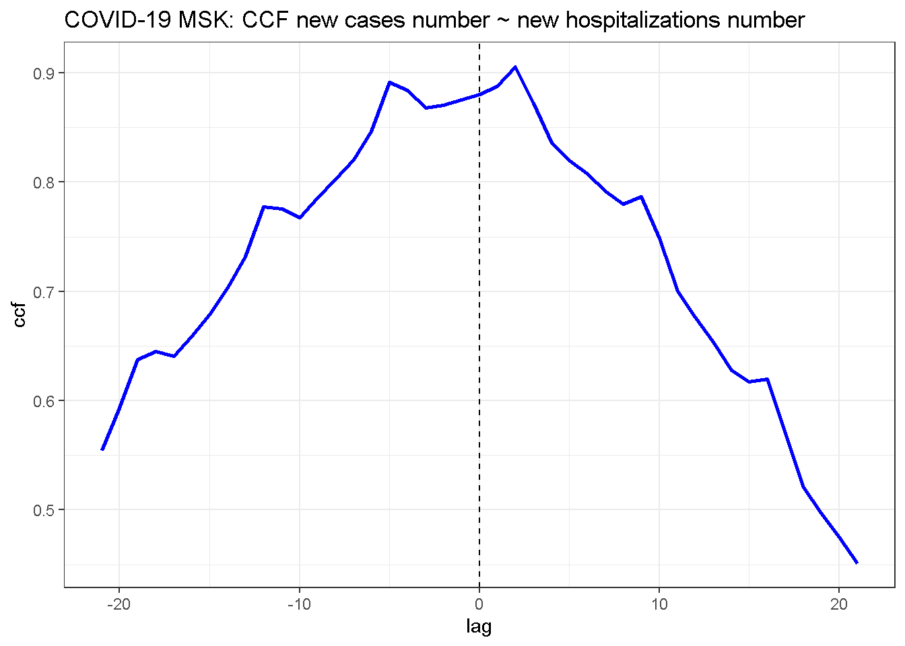


No indication for periodicity in the auto correlation function (same is in logs).


```r
ggAcf(dt2.fill$new_diag)+
  ggtitle("MSK Covid-19: ACF of the time series the number of new cases")+ 
  theme_bw()
```


```r
acf(dt2.fill$new_diag, type="partial")
```

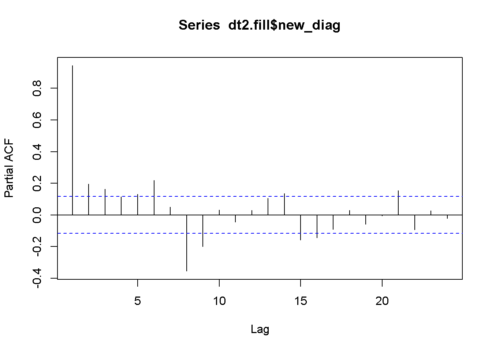

```r
##from monday
cyclic.comp.st.date <- make_date(2021,1,18)
weekdays(cyclic.comp.st.date)
```

```
## [1] "понедельник"
```

```r
plot( stl.log.new_diag)
```


```r
plot( exp( stl.log.new_diag$time.series[1:7,1]), type="l", 
      main="Mult. cyclic weekly conponent")
```

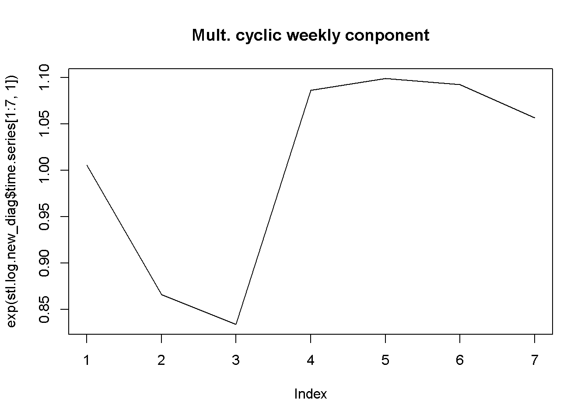

```r
sd( stl.log.new_diag$time.series[,3])
```

```
## [1] 0.09339668
```

```r
vec.weekday_coef <- exp( stl.log.new_diag$time.series[1:7,1])


dt.data[ , new_diag_corr := new_diag/vec.weekday_coef[wday(date, week_start=1)]]

plot( stl.log.new_diag$time.series[1:7,1] / sd( stl.log.new_diag$time.series[,3]),
      main="Relative significance of seasonal component", type="l")
```

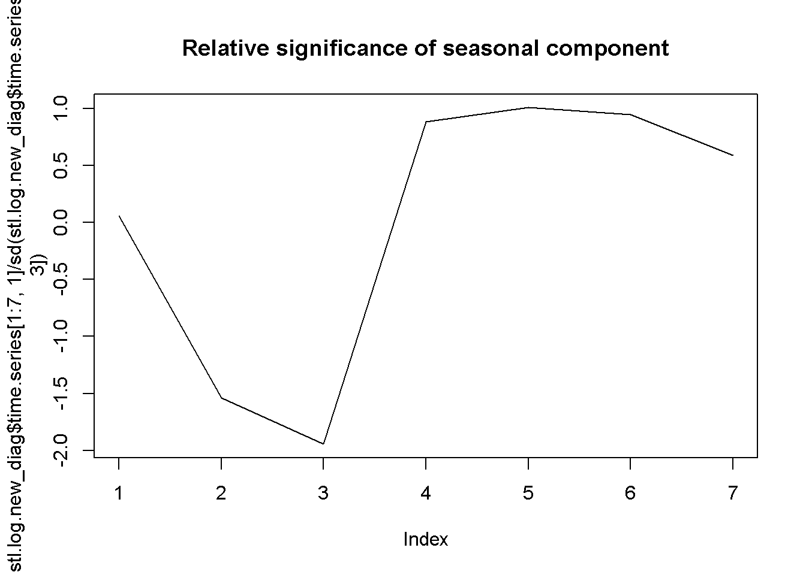

```r
#Main+random (latest)
tail(exp( stl.log.new_diag$time.series[,2] + stl.log.new_diag$time.series[,3]))
```

```
## Time Series:
## Start = c(24, 6) 
## End = c(25, 4) 
## Frequency = 7 
## [1] 6816.947 7216.819 6520.525 6349.104 6740.795 5560.403
```

```r
tail(dt.data[, new_diag_corr])
```

```
## [1] 6816.947 7216.819 6520.525 6349.104 6740.795 5560.403
```

```r
#Main component (latest)
tail( exp( stl.log.new_diag$time.series[,2] ))
```

```
## Time Series:
## Start = c(24, 6) 
## End = c(25, 4) 
## Frequency = 7 
## [1] 6747.856 6627.064 6508.435 6369.887 6234.289 6091.287
```

```r
#Main+random
plot( exp( stl.log.new_diag$time.series[,2] + stl.log.new_diag$time.series[,3]),
      main="New patient withot cycle component")
```

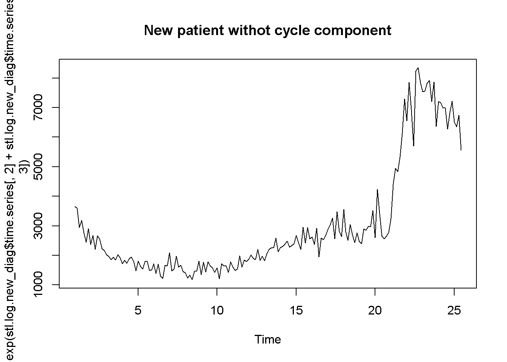

```r
plot( density(stl.log.new_diag$time.series[,3]), main="Random component density")
abline(v=0, lty=2)
```

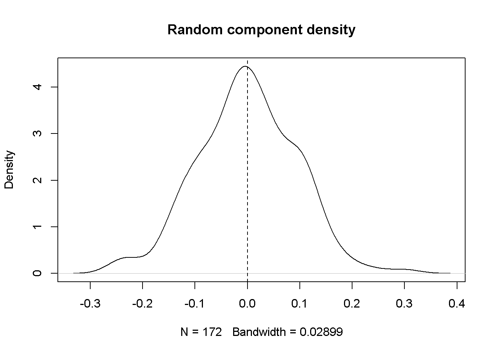

```r
qqnorm(stl.log.new_diag$time.series[,3], 
       ylab="Standardized Residuals", 
       xlab="Normal Scores", 
       main="Random component Normality test") 
qqline(stl.log.new_diag$time.series[,3])
```

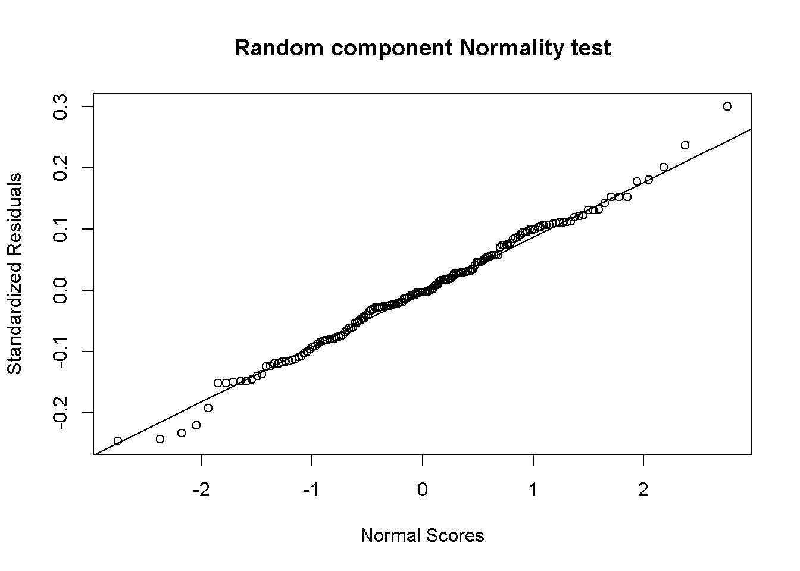

```r
#Weekly cyclicity
sprintf("%.2f", vec.weekday_coef)
```

```
## [1] "1.01" "0.87" "0.83" "1.09" "1.10" "1.09" "1.06"
```

```r
##
#Check
weekdays( make_date(2021,1,18))
```

```
## [1] "понедельник"
```

```r
ts.new_hosp <- ts(as.data.table(dt2.fill)[ date >= cyclic.comp.st.date, 
                                           new_hosp], frequency=7)
stl.log.new_hosp <- stl(log(ts.new_hosp), s.window = "periodic")
plot( stl.log.new_hosp)
```

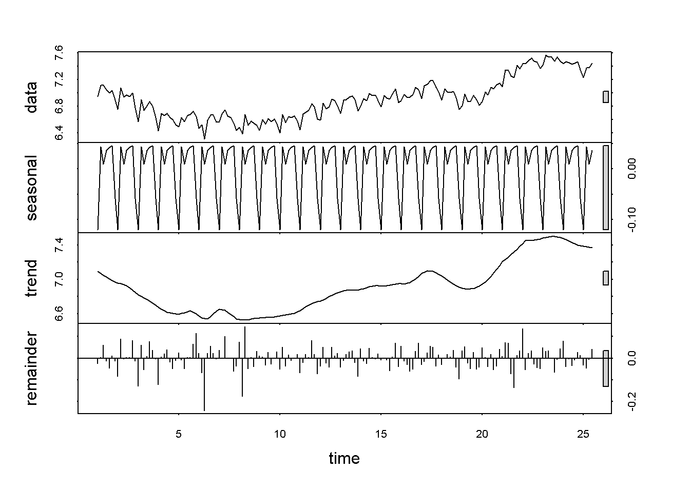

```r
vec.weekday_coef_hosp <- exp( stl.log.new_hosp$time.series[1:7,1])
sprintf("%.2f", vec.weekday_coef_hosp)
```

```
## [1] "0.89" "1.04" "1.01" "1.04" "1.04" "1.05" "0.94"
```

```r
dt.data[ , new_hosp_corr := new_hosp/vec.weekday_coef_hosp[wday(date, week_start=1)]]


ggplot( data.frame( x=c(1:7), cdiag = vec.weekday_coef, chosp = vec.weekday_coef_hosp),
  aes( x= x, y = cdiag, color="Diag. cyclicity coef"))+
  geom_path(size=1)+
  geom_path(aes( x= x, y = chosp, color="Hosp. cyclicity coef"), size=1)+
  xlab("Day of week")+
  ylab("Coeff")+
  ggtitle("New diag. and new hosp. cyclicity coeffs")
```

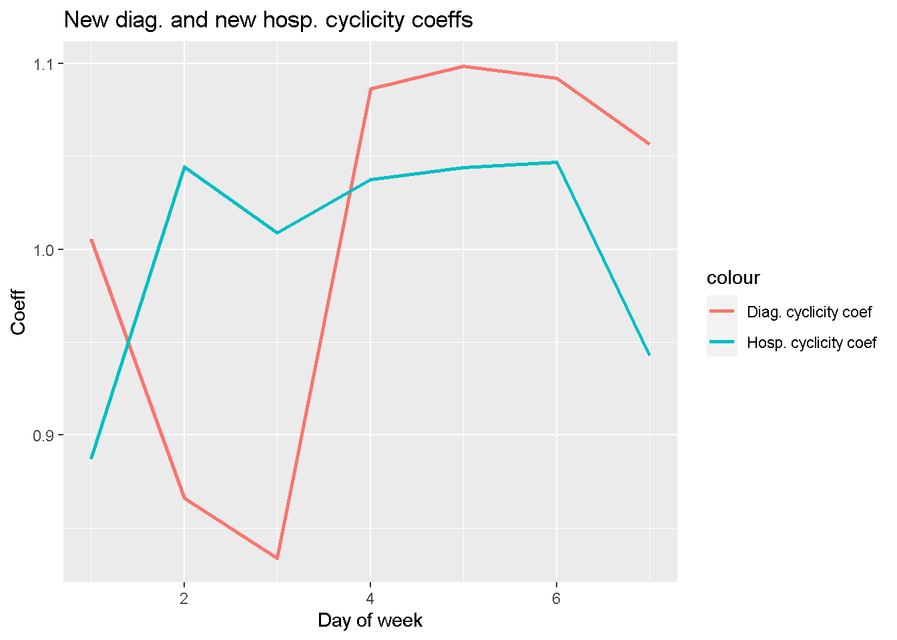

```r
##Note this indicates (if true) that hosp are 5 days lagged relative to diag

ggplot(dt.data, aes(x=date, y=new_diag, color="Diagnosed"))+
  geom_path(size=1)+
  geom_path(aes(y=new_hosp, color="Hospitalized"), size=1)+
  ggtitle("COVID-19 MSK: Number of newly hospitalized and diagnosed patiens")+
  xlab("Date")+
  scale_color_discrete(name="")+
  ylab("Number of patients")+ 
  theme_bw()+
  scale_x_date(date_labels = "%d%-%m-%Y")
```

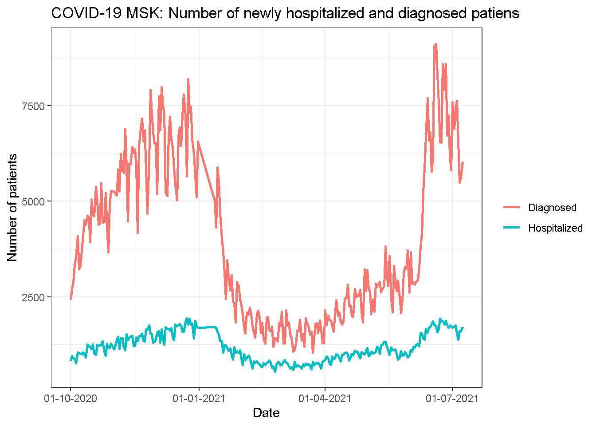

```r
ggplot(dt.data, aes(x=date, y=curr_ivl, color="IVL"))+
  geom_path(size=1)+
  ggtitle("COVID-19 MSK: Number of IVL patiens")+
  xlab("Date")+
  scale_color_discrete(name="")+
  ylab("Number of patients")+ 
  theme_bw()+
  scale_x_date(date_labels = "%d%-%m-%Y")
```

```
## Warning: Removed 1 row(s) containing missing values (geom_path).
```

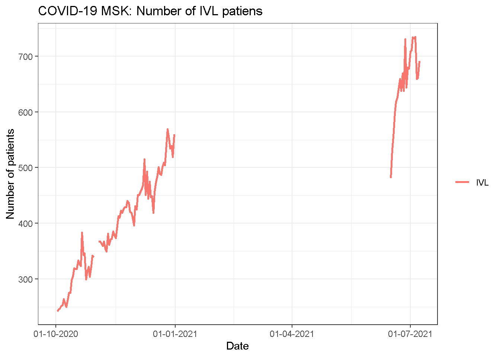


The ratio of the number of hospitalizations to the number of new cases grows with time. More and more sick people skip official medicine entirely.


```r
#Build regression tree for stepwise approximation

dt.data[ , ratio.hosp.diagn := new_hosp/new_diag]
reg.tree <- rpart(ratio.hosp.diagn ~ date, data=dt.data,
                  control=rpart.control(cp = 0.02))
dt.data[ , hosp.rat.tree:= predict(reg.tree, dt.data)]

ggplot(dt.data, aes(x=date, y=new_hosp/new_diag, color="Data"))+
  geom_path(size=1)+
  geom_smooth(aes(color="Lowess"), size=1)+
  ggtitle("COVID-19 MSK: Ratio of the number of new hospitalizations to\n the number of new registered (diagnosed) cases")+
  xlab("Date")+
  ylab("Ratio")+
  geom_path(aes(y=hosp.rat.tree, color="Reg. tree"), size=1)+
  scale_color_discrete(name="") + 
  theme_bw()+
  scale_x_date(date_labels = "%d%-%m-%Y")
```

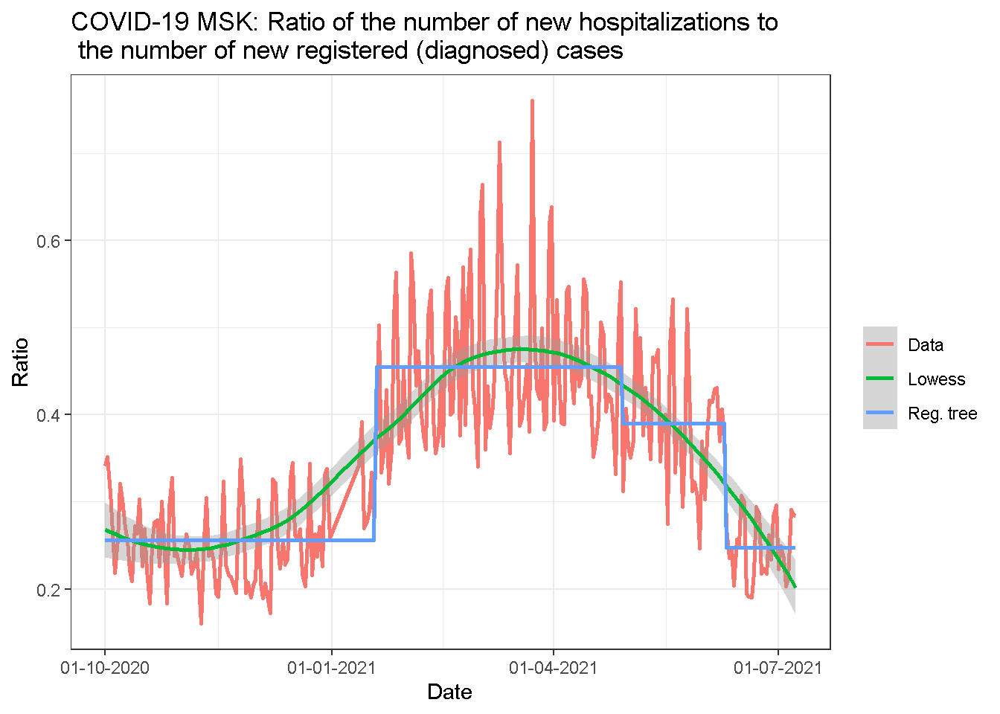

```r
ggplot(dt.data, aes(x=date, y=new_hosp/shift(new_diag, 5, type="lag"), color="Data"))+
  geom_path(size=1)+
  geom_smooth(aes(color="Lowess"), size=1)+
  ggtitle("COVID-19 MSK: Ratio of the number of new hospitalizations to\n the number of new registered (diagnosed) cases, 5d shift")+
  xlab("Date")+
  ylab("Ratio")+
  scale_color_discrete(name="") + 
  theme_bw()+
  scale_x_date(date_labels = "%d%-%m-%Y")
```

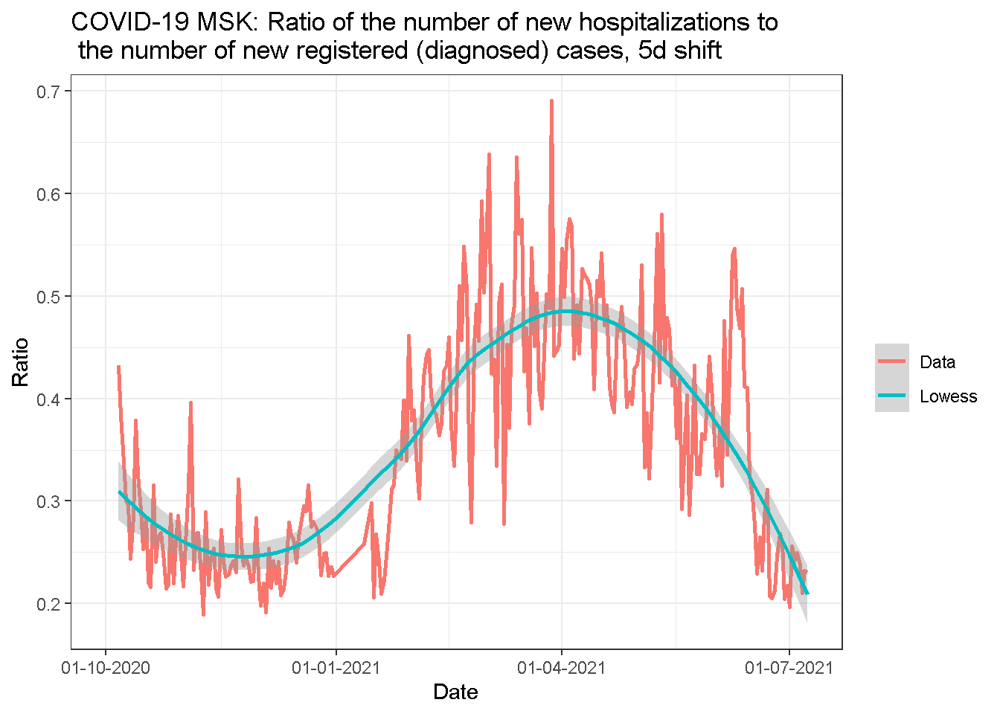


Let's check the ratios by direct calculations: 


```r
display_table<-function(dd, ndigits=1, caption="") {
  if( isTRUE(getOption('knitr.in.progress')) ) {
    knitr::kable(dd, 
                 caption=caption, digits=ndigits, format="html", align="c")
  } else {
    ndg <- getOption("digits")
    options(digits = ndigits)
    print(dd, digits = ndigits)
    options(digits = ndg)
  }
}   

dt.average.hz.ratio <- data.table( `Date` = c("Before 2020-12-31", "After 2021-02-01"),
                                `Ratio`= 
                                  c(dt.data[ date <= as.Date("2020-12-31"), sum(new_hosp)/sum(new_diag)], 
                                  dt.data[ date > as.Date("2021-02-01"), sum(new_hosp)/sum(new_diag)]))
display_table(dt.average.hz.ratio, ndigits=2, caption="Ratio of the number of hospitalizations to the number of cases")
```

<table>
<caption>(\#tab:unnamed-chunk-7)Ratio of the number of hospitalizations to the number of cases</caption>
 <thead>
  <tr>
   <th style="text-align:center;"> Date </th>
   <th style="text-align:center;"> Ratio </th>
  </tr>
 </thead>
<tbody>
  <tr>
   <td style="text-align:center;"> Before 2020-12-31 </td>
   <td style="text-align:center;"> 0.24 </td>
  </tr>
  <tr>
   <td style="text-align:center;"> After 2021-02-01 </td>
   <td style="text-align:center;"> 0.35 </td>
  </tr>
</tbody>
</table>

```r
cbbPalette <- c("#000000", "#E69F00", "#56B4E9", "#009E73", "#F0E442", "#0072B2", "#D55E00", "#CC79A7")

ggplot(dt.data, aes(x=date, y=new_diag, color="Diagnosed"))+
  geom_path(size=1)+
  geom_path(aes(y=new_hosp/0.45, color="Hospitalized / 0.45"), size=1)+
  ggtitle("COVID-19 MSK: Number of newly hospitalized (scaled) and diagnosed patients")+
  xlab("Date")+
  ylab("Number of patients")+ 
  theme_bw()+
  scale_x_date(date_labels = "%d%-%m-%Y")+
  scale_color_manual(name="", breaks=c("Diagnosed", "Hospitalized / 0.45"),
                       values=cbbPalette[2:3])
```

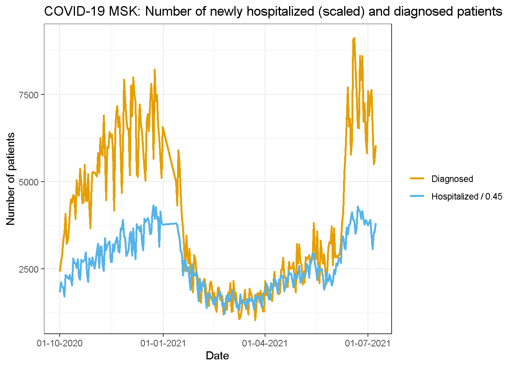

```r
#  geom_path(aes(y=new_diag_corr, color="Diagnosed,\nweekday corrected"), size=1)+


ggplot(dt.data, aes(x=date, y=new_diag, color="Diagnosed"))+
  geom_path(size=0.5)+
  geom_path(aes(y=new_diag_corr, color="Diagnosed,\nweekday corrected"), size=1)+
  ggtitle("COVID-19 MSK: Week cycle corrected number of newly diagnosed patients")+
  geom_smooth(aes(y=new_diag_corr, color="Decycled, loess"), span=0.1)+
  xlab("Date")+
  ylab("Number of patients")+ 
  theme_bw()+
  scale_x_date(date_labels = "%d%-%m-%Y")+
  scale_color_discrete(name="")
```

```
## `geom_smooth()` using method = 'loess' and formula 'y ~ x'
```

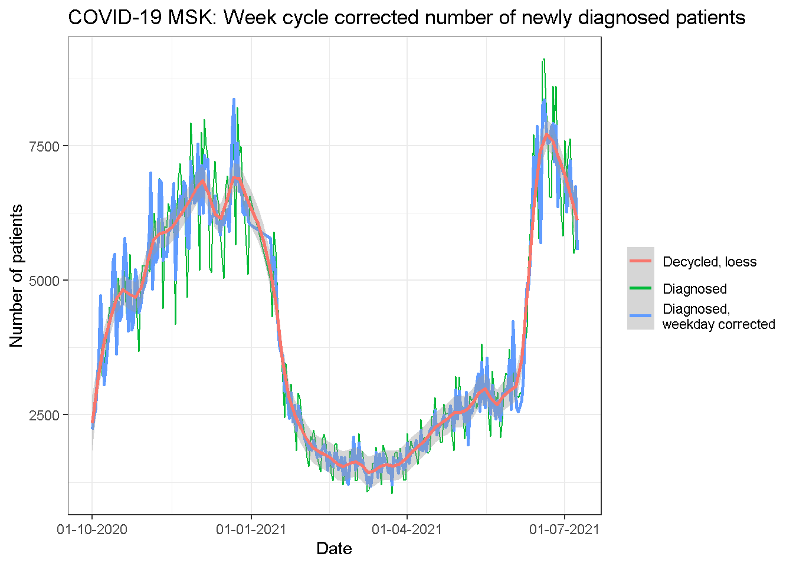

```r
ggplot(dt.data, aes(x=date, y=new_diag, color="Diagnosed"))+ylim(1,1e4)+
  geom_path(size=0.5)+
  geom_path(aes(y=new_diag_corr, color="Diagnosed,\nweekday corrected"), size=1)+
  ggtitle("COVID-19 MSK: Week cycle corrected number of newly diagnosed patients\n(lof scale)")+
  geom_smooth(aes(y=new_diag_corr, color="Decycled, loess"), span=0.1)+
  xlab("Date")+
  ylab("Number of patients")+ 
  theme_bw()+
  scale_x_date(date_labels = "%d%-%m-%Y")+
  scale_color_discrete(name="")+scale_y_log10()
```

```
## Scale for 'y' is already present. Adding another scale for 'y', which will
## replace the existing scale.
## `geom_smooth()` using method = 'loess' and formula 'y ~ x'
```

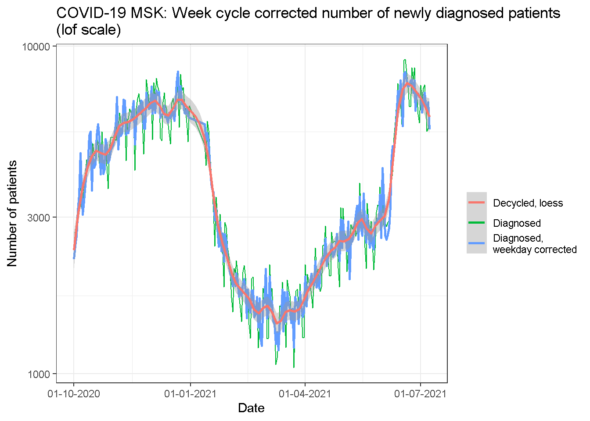

```r
ggplot(dt.data[ date>=make_date(2021,5,1)], aes(x=date, y=new_diag, color="Diagnosed"))+ylim(1,1e4)+
  geom_path(size=0.5)+
  geom_path(aes(y=new_diag_corr, color="Diagnosed,\nweekday corrected"), size=1)+
  ggtitle("COVID-19 MSK: Week cycle corrected number of newly diagnosed patients\n(zoomed)")+
  geom_smooth(aes(y=new_diag_corr, color="Decycled, loess"), span=0.25)+
  xlab("Date")+
  ylab("Number of patients")+ 
  theme_bw()+
  scale_x_date(date_labels = "%d%-%m-%Y")+
  scale_color_discrete(name="")
```

```
## `geom_smooth()` using method = 'loess' and formula 'y ~ x'
```

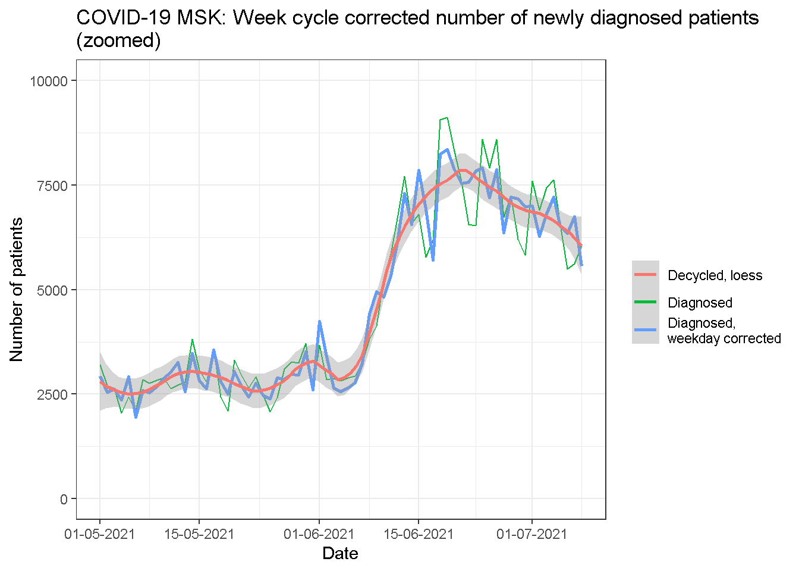

```r
ggplot(dt.data, aes(x=date, y=new_hosp, color="N. hosp."))+
  geom_path(size=0.5)+
  geom_path(aes(y=new_hosp_corr, color="N. hosp.,\ndecycled"), size=1)+
  ggtitle("COVID-19 MSK: Cycle corrected number of newly hospitalized patients")+
  geom_smooth(aes(y=new_hosp_corr, color="N. hosp., decycled,\nloess (0.1)"), span=0.1, size=1)+
  xlab("Date")+
  ylab("Number of patients")+ 
  theme_bw()+
  scale_x_date(date_labels = "%d%-%m-%Y")+
  scale_color_discrete(name="")
```

```
## `geom_smooth()` using method = 'loess' and formula 'y ~ x'
```

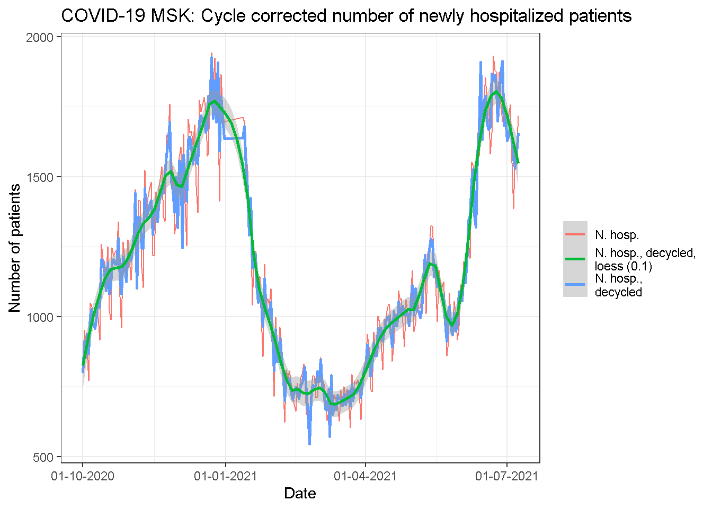

```r
ggplot(dt.data[date>make_date(2021,5,1)], aes(x=date, y=new_hosp, color="N. hosp."))+
  geom_path(size=0.5)+
  geom_path(aes(y=new_hosp_corr, color="N. hosp.,\ndecycled"), size=1)+
  ggtitle("COVID-19 MSK: Cycle corrected number of newly hospitalized patients")+
  geom_smooth(aes(y=new_hosp_corr, color="N. hosp., decycled,\nloess (0.25)"), span=0.25, size=1)+
  xlab("Date")+
  ylab("Number of patients")+ 
  theme_bw()+
  scale_x_date(date_labels = "%d%-%m-%Y")+
  scale_color_discrete(name="")
```

```
## `geom_smooth()` using method = 'loess' and formula 'y ~ x'
```

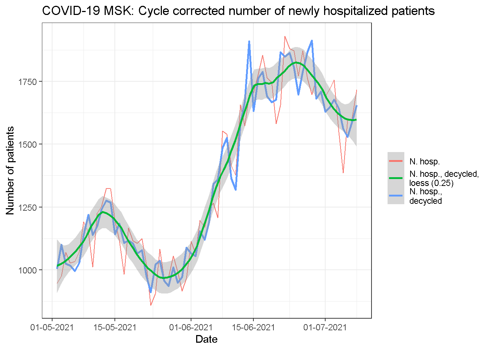

```r
ggplot(dt.data, aes(x=date, y=new_diag, color="Diagnosed"))+
  geom_smooth(span=0.2)+
  geom_smooth(aes(y=new_hosp/0.45, color="Hospitalized / 0.45"), span=0.2)+
  ggtitle("COVID-19 MSK: Number of newly hospitalized (scaled) and\ndiagnosed patiens (loess, span=0.2)")+
  xlab("Date")+
  scale_color_discrete(name="")+
  ylab("Number of patients")+ 
  theme_bw()+
  scale_x_date(date_labels = "%d%-%m-%Y")
```

```
## `geom_smooth()` using method = 'loess' and formula 'y ~ x'
## `geom_smooth()` using method = 'loess' and formula 'y ~ x'
```

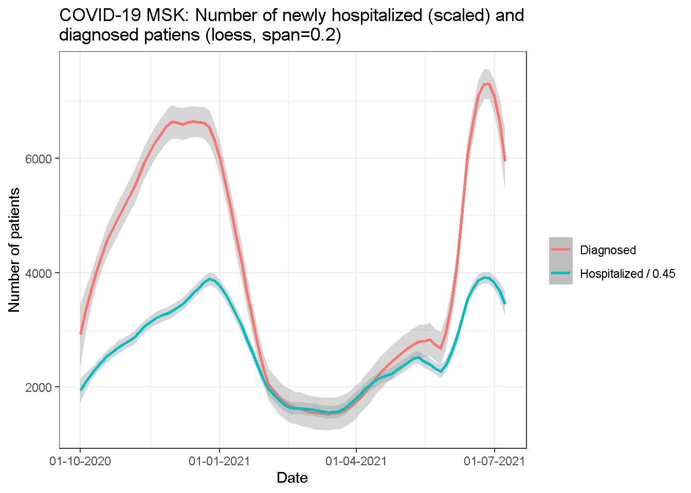

```r
ggplot(dt.data, aes(x=new_diag, y=new_hosp))+
  geom_point()+
  geom_smooth(span=0.2)+
  ggtitle("COVID-19 MSK: Number of newly hospitalized vs diagnosed patiens")+
  xlab("New cases")+
  scale_color_discrete(name="")+
  ylab("New hospitalizations")+ 
  theme_bw()
```

```
## `geom_smooth()` using method = 'loess' and formula 'y ~ x'
```

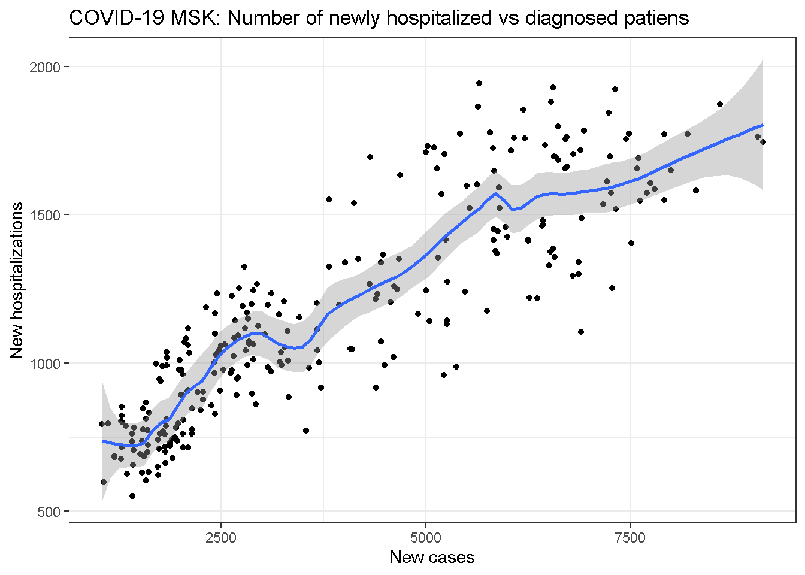

```r
ggplot(dt.data, aes(x=log(new_diag), y=log(new_hosp)))+
  geom_point()+
  geom_smooth(span=0.4)+
  ggtitle("COVID-19 MSK: Number of newly hospitalized vs diagnosed patiens")+
  xlab("New cases")+
  scale_color_discrete(name="")+
  ylab("New hospitalizations")+ 
  theme_bw()
```

```
## `geom_smooth()` using method = 'loess' and formula 'y ~ x'
```

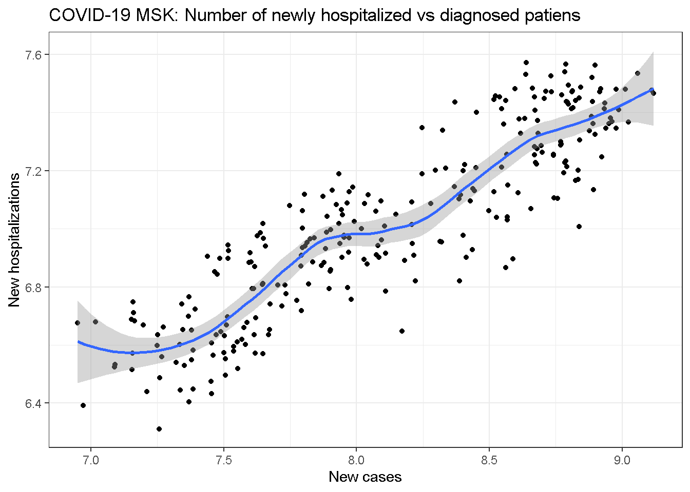

```r
lm1 <- lm(log(new_hosp) ~ log(new_diag),data=dt.data)
summary( lm1)
```

```
## 
## Call:
## lm(formula = log(new_hosp) ~ log(new_diag), data = dt.data)
## 
## Residuals:
##      Min       1Q   Median       3Q      Max 
## -0.39630 -0.09274 -0.00174  0.11004  0.30156 
## 
## Coefficients:
##               Estimate Std. Error t value Pr(>|t|)    
## (Intercept)    3.09652    0.12370   25.03   <2e-16 ***
## log(new_diag)  0.48310    0.01519   31.80   <2e-16 ***
## ---
## Signif. codes:  0 '***' 0.001 '**' 0.01 '*' 0.05 '.' 0.1 ' ' 1
## 
## Residual standard error: 0.1423 on 266 degrees of freedom
## Multiple R-squared:  0.7918,	Adjusted R-squared:  0.791 
## F-statistic:  1011 on 1 and 266 DF,  p-value: < 2.2e-16
```

```r
qqnorm(residuals(lm1))
qqline(residuals(lm1))
```


```r
# ggplot(dt.data, aes(x=shift(new_diag, 7, "lag"), y=new_hosp))+
#   geom_point()+
#   geom_smooth(span=0.4)+
#   ggtitle("COVID-19 MSK: Number of newly hospitalized vs diagnosed patiens, lag 7")+
#   xlab("New cases")+
#   scale_color_discrete(name="")+
#   ylab("New hospitalizations")+ 
#   theme_bw()


ggplot(dt.data, aes(x=date, y=(new_diag/shift(new_diag,7)-1)), color="Data")+
  geom_path()+
  geom_smooth(span=0.1)+
  ggtitle("COVID-19 MSK: Wow change in the number of newly diagnosed patiens")+
  xlab("Date")+
  scale_color_discrete(name="")+
  ylab("(N / lag(N,7)) -1")+ 
  theme_bw()+
  scale_x_date(date_labels = "%d%-%m-%Y")
```

```
## `geom_smooth()` using method = 'loess' and formula 'y ~ x'
```

```
## Warning: Removed 7 rows containing non-finite values (stat_smooth).
```

```
## Warning: Removed 7 row(s) containing missing values (geom_path).
```

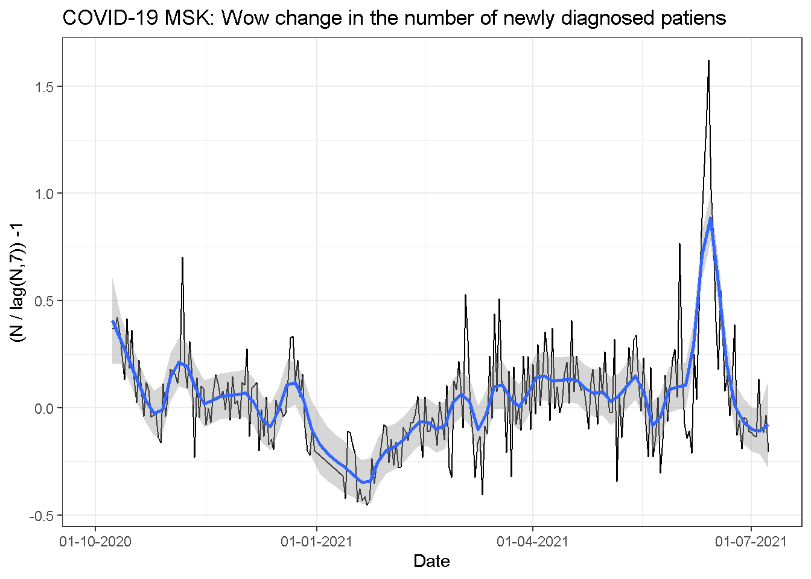

```r
library(zoo)
```

```
## Warning: package 'zoo' was built under R version 3.6.3
```

```
## 
## Attaching package: 'zoo'
```

```
## The following objects are masked from 'package:base':
## 
##     as.Date, as.Date.numeric
```

```r
rsum_cumsum <- function(x, n = 7L) {
  tail(cumsum(x) - cumsum(c(rep(0, n), head(x, -n))), -n + 1)
}


rsum_ratio <- function(x) {
  y <- rsum_cumsum(x)
  return( y/shift(y,7))  
}

length( dt.data$new_diag)
```

```
## [1] 268
```

```r
length( rsum_cumsum(dt.data$new_diag))
```

```
## [1] 262
```

```r
length( rsum_ratio(dt.data$new_diag)-1)
```

```
## [1] 262
```

```r
length(dt.data$date)
```

```
## [1] 268
```

```r
dt.data[ , length(date[7:length(date)])]
```

```
## [1] 262
```

```r
dt.data[ , new_diag_week_av := (cumsum(new_diag)- shift(cumsum(new_diag),7 ))/7]

ggplot(dt.data, aes(x=date, y=new_diag_week_av/shift(new_diag_week_av,7)-1, color="Data"))+
  geom_path()+
  ggtitle("COVID-19 MSK: Wow change in the number of newly diagnosed patiens\n(week over week)")+
  xlab("Date")+
  scale_color_discrete(name="")+
  ylab("N(7d)/lag(N(7d),7)-1")+ 
  theme_bw()+
  scale_x_date(date_labels = "%d%-%m-%Y")
```

```
## Warning: Removed 14 row(s) containing missing values (geom_path).
```

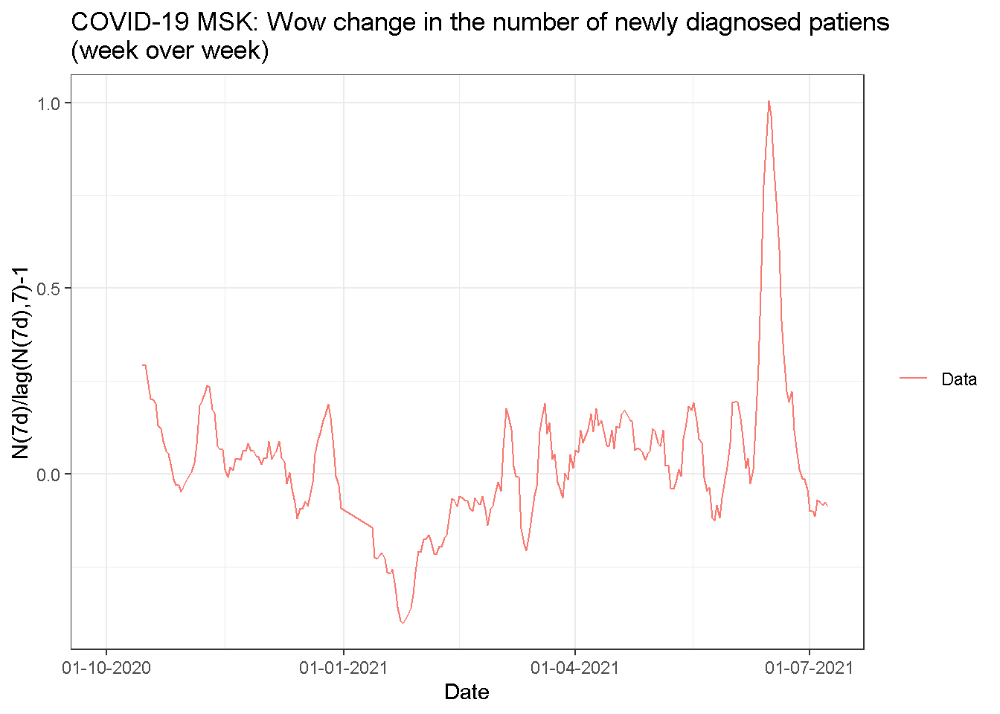

```r
tail(dt.data[,.(date, new_diag, new_diag_corr, new_diag_week_av, new_hosp, new_hosp_corr)],7)
```

```
##          date new_diag new_diag_corr new_diag_week_av new_hosp new_hosp_corr
## 1: 2021-07-02     6893      6273.739         7012.714     1719      1646.555
## 2: 2021-07-03     7446      6816.947         6848.143     1756      1677.497
## 3: 2021-07-04     7624      7216.819         6976.857     1548      1641.660
## 4: 2021-07-05     6557      6520.525         6878.429     1385      1560.852
## 5: 2021-07-06     5498      6349.104         6776.857     1598      1529.874
## 6: 2021-07-07     5621      6740.795         6748.000     1601      1586.684
## 7: 2021-07-08     6040      5560.403         6525.571     1717      1654.742
```

